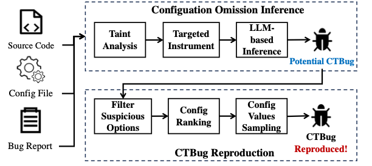

# MissConf: LLM-Enhanced Reproduction of Configuration-Triggered Bugs

Bug reproduction stands as a pivotal phase in software development, but the absence of configuration information emerges as the main obstacle to effective bug reproduction. Since configuration options generally control critical branches of the software, many bugs can only be triggered under specific configuration settings. We refer to these bugs as configuration-triggered bugs or CTBugs for short. The reproduction of CTBugs consumes considerable time and manual efforts due to the challenges in deducing the missing configuration options within the vast search space of configurations. This complexity contributes to a form of technical debt in software development. 
MissConf is the first LLM-enhanced automated tool for CTBug reproduction. MissConf first leverages the LLM to infer whether crucial configuration options are missing in the bug report. Once a suspect CTBug is found, MissConf employs configuration taint analysis and dynamic monitoring methods to filter suspicious configuration options set. Furthermore, it adopts a heuristic strategy for identifying crucial configuration options and their corresponding values. We evaluated MissConf on 5 real-world software systems. The experimental results demonstrate that MissConf successfully infers the 84% (41/49) of the CTBugs and reproduces the 65% (32/49) CTBugs. In the reproduction phase, MissConf eliminates up to 76% of irrelevant configurations, offering significant time savings for developers.



## Requirements
- Ubuntu 20.04
- llvm-10.0.0

## Content
### TaintAnalysis
Our taint analysis tool is modified based on [ConfTainter](https://github.com/wangteng13/ConfTainter), in the "TaintAnalysis" folder.
The taint analysis tool takes two inputs: the IR file of the SUT and a configuration file. You can refer to [ConfTainter](https://github.com/wangteng13/ConfTainter) for how the SUT is compiled into the required IR file. The configuration file records the specific mapping of software configuration to variables in the source code.

### Instrument
The "Instrument" file contains the code for instrumentation, primarily involving modifications to the Clang compiler, which we called ```clang-wrapper```. 
When the software is compiled using the ```clang-wrapper```, it can record the number of times configuration-related instructions are triggered in each execution.

#### How to compile clang-wrapper
Enter the src directory and compile easily.

```
cd /path/to/MissConf/
make
```
#### How to use clang-wrapper to instrument guided by taint result
Before we start to instrument, we need to set an environment variable `TAINT_RESULT` to indicate the taint result file path and `WRAPPER_PATH` to indicate the path of `clang-wrapper`.

```
export TAINT_RESULT=/path/to/result.txt
export WRAPPER_PATH=/path/to/MissConf/Instrument/ClangWrapper
```

Now, we need to request a shared memory
```
/path/to/MissConf/Instrument/ClangWrapper/shm_init
```

Besides, we need to set compiler options to adapt to the results of taint analysis

```
export CFLAGS="-Wno-error -g -O0 -fno-discard-value-names"
export CXXFLAGS="-Wno-error -g -O0 -fno-discard-value-names"
```

Next, just simply use `/path/to/MissConf/Instrument/ClangWrapper/clang-wrapper` and `/path/to/MissConf/Instrument/ClangWrapper/clang-wrapper++` to start our directed instrumentation.
```
/path/to/MissConf/Instrument/ClangWrapper/clang-wrapper test.c
/path/to/MissConf/Instrument/ClangWrapper/clang-wrapper++ test.cc
```
To use clang-wrapper more convenient, we can export the directory path to env `$PATH`:

```
echo 'export PATH=$PATH:/path/to/MissConf/Instrument/ClangWrapper/' >> /etc/profile
// Make environment variables take effect
source /etc/profile
```
Then we can instrument more easily by simply entering `clang-wrapper test.c` or `clang-wrapper++ test.cc`


### CTBugReproduction

Enter the directory of MissConf and simply use it with `MissConf.py`
```
cd /path/to/MissConf/CTBugReproduction/
python3 MissConf.py /path/to/testcase/ /path/to/config.txt /path/to/exe
```
`/path/to/testcase/` is the directory name that stores all test cases.
`/path/to/config.txt` is the text file that stores all key-values.
`/path/to/exe` is the path to the instrumented executable program.  

The output will be stored to the directory `/root/output/`, maybe you need to construct it before using MissConf.

